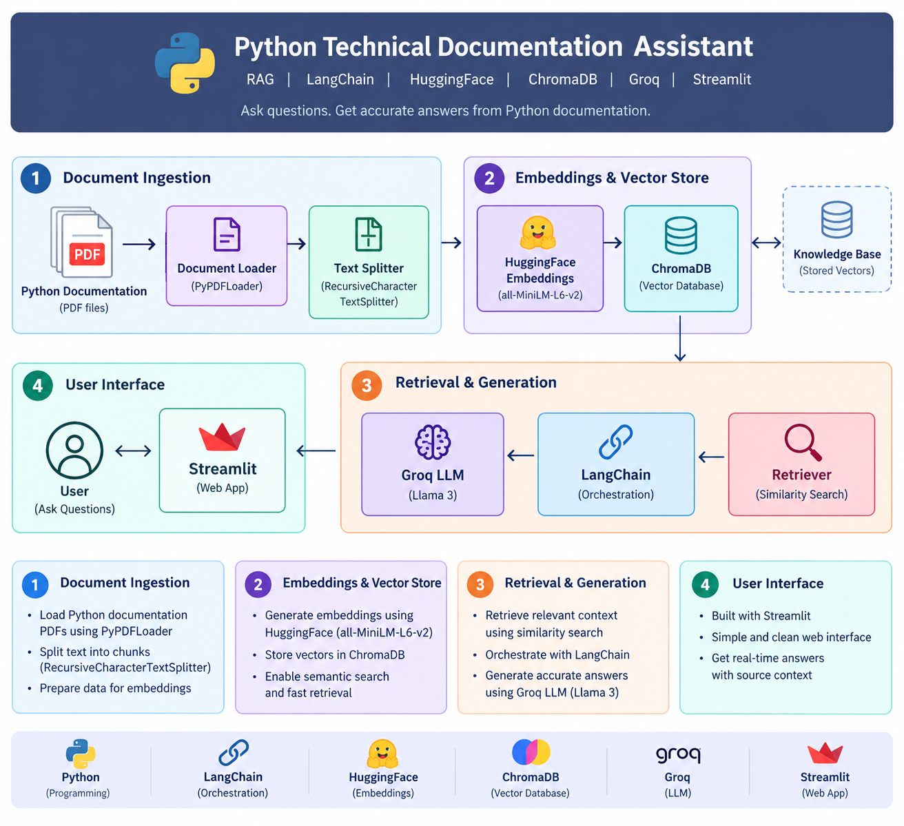

\# 🤖 Python Technical Documentation Assistant


An AI-powered Retrieval-Augmented Generation (RAG) chatbot that answers Python technical questions using the official Python 3.11 documentation as its knowledge base.


The project combines document retrieval, semantic search, embeddings, vector databases, and a Large Language Model (LLM) to generate grounded answers with source references.


\---
## 🏗️ System Architecture

The application follows a Retrieval-Augmented Generation (RAG) architecture to provide grounded answers from the Python 3.11 technical documentation.



### Architecture Flow

1. **Document Ingestion** — Python documentation PDFs are loaded using PyPDFLoader and divided into smaller chunks using RecursiveCharacterTextSplitter.
2. **Embeddings & Vector Store** — Text chunks are converted into embeddings using HuggingFace `all-MiniLM-L6-v2` and stored in ChromaDB.
3. **Retrieval & Generation** — Relevant documents are retrieved and passed through LangChain to the Groq LLM for answer generation.
4. **User Interface** — Users interact with the RAG assistant through the Streamlit web application.


\## 📌 Project Overview


Technical documentation can contain a large amount of information, making it difficult to quickly find specific answers.


This project provides an interactive chatbot that allows users to ask questions about Python and receive answers based on the Python documentation stored in the project's knowledge base.


The system follows a Retrieval-Augmented Generation (RAG) architecture.


Instead of relying only on the LLM's internal knowledge, the system retrieves relevant documentation chunks and provides them as context to the LLM before generating an answer.


\---


\## 🎯 Project Objective


The main objectives of this project are:


\- Build a working RAG pipeline using Python documentation.

\- Load and preprocess PDF documents.

\- Split documents into meaningful text chunks.

\- Generate semantic embeddings for the chunks.

\- Store embeddings in ChromaDB.

\- Retrieve relevant information using similarity-based retrieval.

\- Use MMR retrieval to improve document diversity.

\- Generate grounded answers using a Groq-hosted LLM.

\- Support conversation-aware follow-up questions.

\- Display source documents and page numbers.

\- Provide an interactive Streamlit chatbot interface.

\- Reduce hallucinations by restricting answers to the retrieved documentation.


\---


\## ✨ Key Features


\### 1. PDF Document Ingestion


The system loads Python documentation PDFs from the project's knowledge base.


\### 2. Text Chunking


Large documents are divided into smaller chunks using a recursive text splitter.


Current configuration:


\- Chunk size: 1000 characters

\- Chunk overlap: 200 characters


\### 3. Semantic Embeddings


The project uses:


`sentence-transformers/all-MiniLM-L6-v2`


to convert text chunks into numerical vector representations.


\### 4. ChromaDB Vector Store


The generated embeddings and document chunks are stored in ChromaDB for efficient retrieval.


\### 5. MMR Retrieval


Maximum Marginal Relevance (MMR) retrieval is used to retrieve relevant information while improving diversity among retrieved documents.


\### 6. Query Rewriting


The chatbot can rewrite follow-up questions into standalone questions using conversation history.


For example:


User:


> What is a Python list?


Follow-up:


> What is the difference between it and a tuple?


The system can use the previous conversation to understand what "it" refers to.


\### 7. Grounded LLM Responses


The retrieved documentation is provided to the LLM as context.


The chatbot is instructed to answer only using information supported by the provided documentation.


\### 8. Source References


The application displays the source PDF and page number used for the response.


\### 9. Streamlit Chat Interface


The chatbot provides an interactive web interface where users can ask multiple questions and maintain conversation history.


\### 10. Out-of-Domain Handling


If the requested information cannot be found in the Python documentation, the chatbot responds that the information could not be found instead of intentionally generating an unsupported answer.


\---


\## 🏗️ RAG Architecture


```text

&#x20;                   ┌─────────────────────┐

&#x20;                   │   Python PDF Docs   │

&#x20;                   └──────────┬──────────┘

&#x20;                              │

&#x20;                              ▼

&#x20;                   ┌─────────────────────┐

&#x20;                   │  Document Loader    │

&#x20;                   │      PyPDF          │

&#x20;                   └──────────┬──────────┘

&#x20;                              │

&#x20;                              ▼

&#x20;                   ┌─────────────────────┐

&#x20;                   │   Text Splitter     │

&#x20;                   │ Recursive Splitter  │

&#x20;                   └──────────┬──────────┘

&#x20;                              │

&#x20;                              ▼

&#x20;                   ┌─────────────────────┐

&#x20;                   │    Embeddings       │

&#x20;                   │ MiniLM-L6-v2        │

&#x20;                   └──────────┬──────────┘

&#x20;                              │

&#x20;                              ▼

&#x20;                   ┌─────────────────────┐

&#x20;                   │     ChromaDB        │

&#x20;                   │    Vector Store     │

&#x20;                   └──────────┬──────────┘

&#x20;                              │

&#x20;                              │

User Question ────────────────►│

&#x20;                              ▼

&#x20;                   ┌─────────────────────┐

&#x20;                   │   MMR Retriever     │

&#x20;                   └──────────┬──────────┘

&#x20;                              │

&#x20;                              ▼

&#x20;                   ┌─────────────────────┐

&#x20;                   │ Retrieved Context   │

&#x20;                   └──────────┬──────────┘

&#x20;                              │

&#x20;                              ▼

&#x20;                   ┌─────────────────────┐

&#x20;                   │      Groq LLM       │

&#x20;                   │   GPT-OSS-20B       │

&#x20;                   └──────────┬──────────┘

&#x20;                              │

&#x20;                              ▼

&#x20;                   ┌─────────────────────┐

&#x20;                   │ Grounded Answer +   │

&#x20;                   │      Sources        │

&#x20;                   └─────────────────────┘

