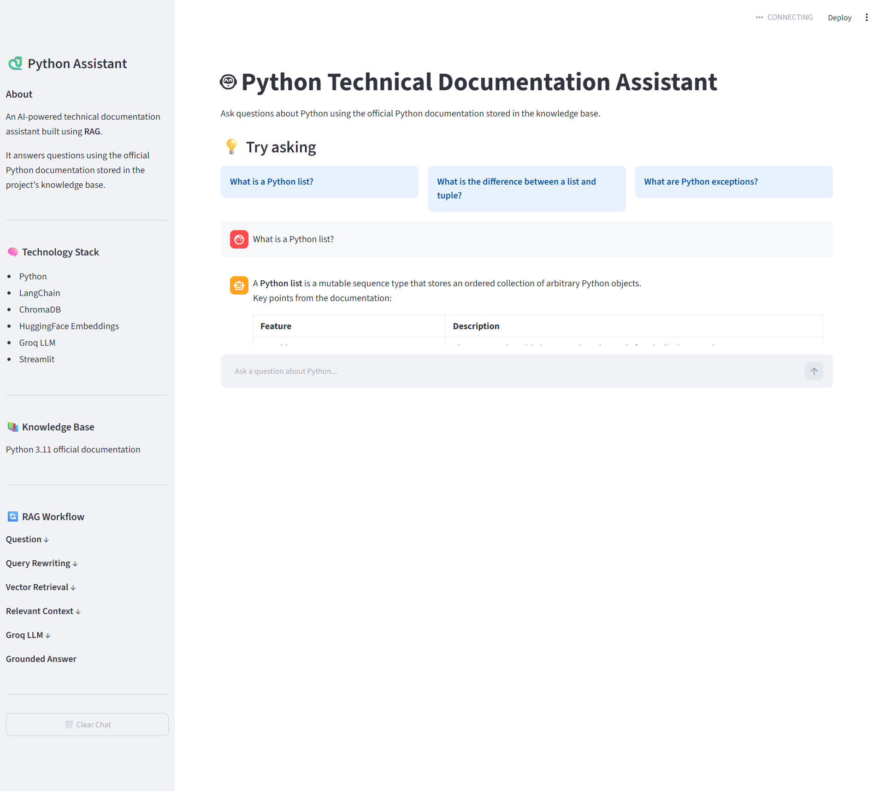
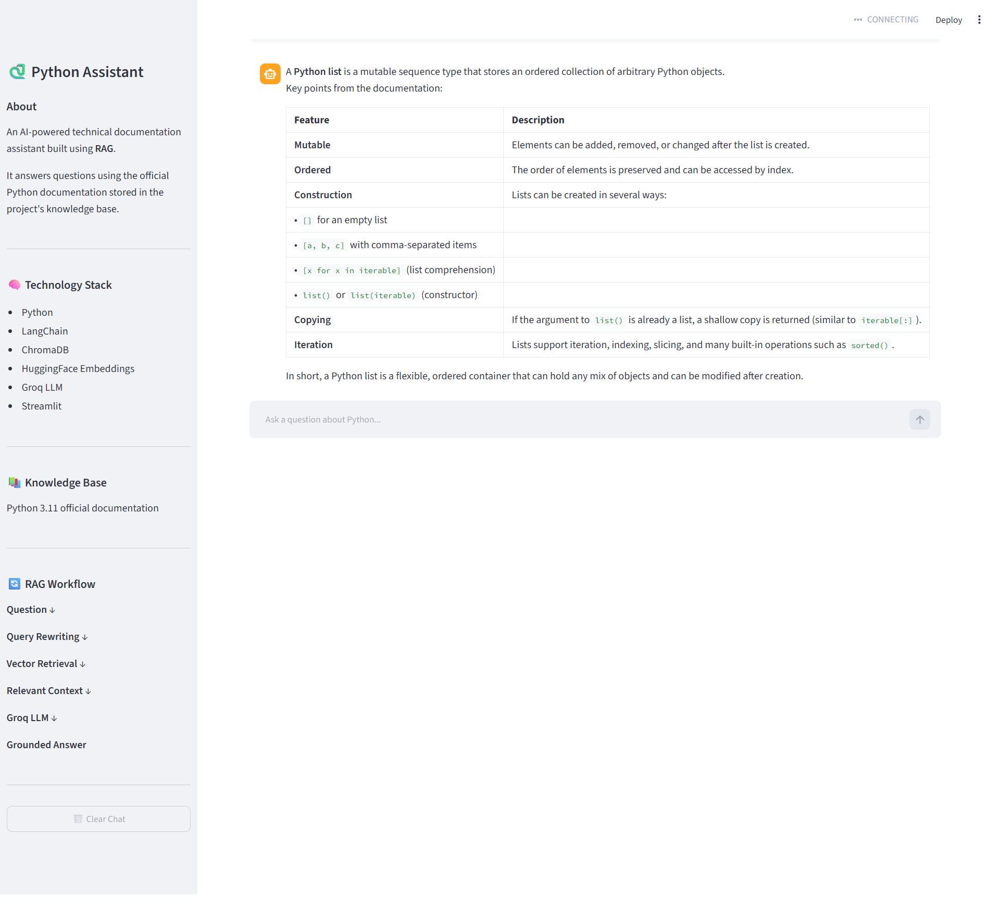
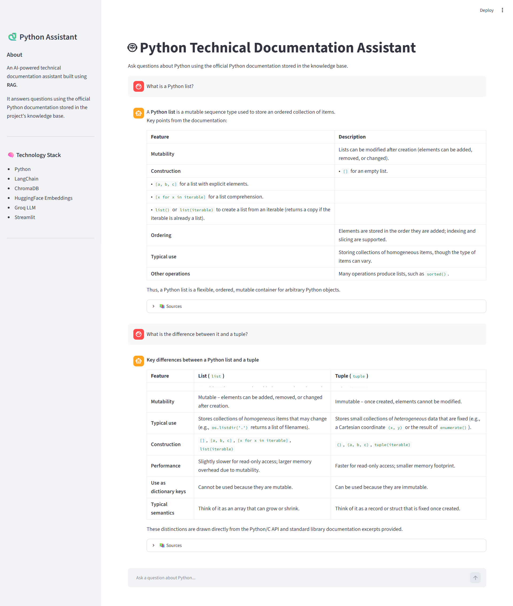

# 🤖 Python Technical Documentation Assistant

An AI-powered **Retrieval-Augmented Generation (RAG)** chatbot that answers Python technical questions using the official **Python 3.11 documentation** as its knowledge base.

The application combines document retrieval, semantic search, vector embeddings, ChromaDB, LangChain, a Groq-hosted LLM, and Streamlit to provide grounded technical answers with source references.

---

## 📌 Project Overview

The **Python Technical Documentation Assistant** helps developers and learners quickly find accurate information from Python's official technical documentation.

Instead of relying only on the language model's internal knowledge, the application retrieves relevant documentation from a local vector database and provides that context to the LLM before generating an answer.

This approach helps keep responses grounded in the project's knowledge base.

---

## 🎯 Objective

The main objectives of this project are:

- Build a practical Retrieval-Augmented Generation application.
- Use official Python documentation as a domain-specific knowledge base.
- Convert documentation into searchable vector embeddings.
- Retrieve relevant documentation for user questions.
- Generate grounded answers using an LLM.
- Support conversational follow-up questions.
- Display source documents and page references.
- Provide an interactive web interface using Streamlit.

---

## ✨ Key Features

### 📚 Documentation-Based Question Answering

Answers Python technical questions using the official Python 3.11 documentation stored in the knowledge base.

### 🔎 Semantic Search

Uses HuggingFace embeddings and ChromaDB to retrieve documentation based on semantic similarity.

### 🧠 Retrieval-Augmented Generation

Relevant documentation is retrieved first and then provided to the LLM as context before generating the final answer.

### 💬 Conversational Follow-Up Questions

The application maintains conversation history and rewrites follow-up questions into standalone search queries.

For example:

> What is a Python list?

Followed by:

> What is the difference between it and a tuple?

The system understands that **"it" refers to the Python list**.

### 📖 Source References

The application displays the source document and page number used to generate the answer.

### 🛡️ Grounded Responses

The LLM is instructed to answer using only the retrieved documentation context.

If relevant information cannot be found, the assistant states that the information could not be found in the provided Python documentation.

### 🖥️ Streamlit Interface

Provides a clean conversational interface for interacting with the RAG assistant.

### 🧹 Chat Management

Users can clear the current conversation using the **Clear Chat** button.

---

## 🏗️ System Architecture

The application follows a Retrieval-Augmented Generation architecture.


### Architecture Flow

1. **Document Ingestion**
   - Python documentation PDFs are loaded using `PyPDFLoader`.
   - Documents are divided into smaller chunks using `RecursiveCharacterTextSplitter`.

2. **Embeddings & Vector Store**
   - Text chunks are converted into vector embeddings using HuggingFace `all-MiniLM-L6-v2`.
   - Embeddings are stored in ChromaDB.

3. **Retrieval & Generation**
   - Relevant document chunks are retrieved from ChromaDB.
   - LangChain coordinates the retrieval and generation workflow.
   - Retrieved context is provided to the Groq-hosted LLM.

4. **User Interface**
   - Users interact with the assistant through the Streamlit web application.

---

## 🖥️ Application Screenshots

### 1. Main Application

The Streamlit interface provides a clean conversational experience for asking questions about Python technical documentation.



### 2. RAG Answer

The assistant retrieves relevant documentation context and generates a grounded technical answer.



### 3. Conversational RAG

The assistant maintains conversation context and correctly handles follow-up questions.



---

## 🔄 RAG Workflow

The complete workflow is:

```text
User Question
      ↓
Conversation History
      ↓
Query Rewriting
      ↓
Semantic Retrieval
      ↓
ChromaDB Vector Store
      ↓
Relevant Documentation Chunks
      ↓
Context Construction
      ↓
Groq-hosted LLM
      ↓
Grounded Answer
      ↓
Source Documents + Page Numbers
Rag Client Project/
│
├── docs/
│   ├── architecture.png
│   ├── main-app.png
│   ├── rag-answer.png
│   └── conversational-rag.png
│
├── src/
│   ├── __init__.py
│   ├── document_loader.py
│   ├── embeddings.py
│   ├── rag_pipeline.py
│   ├── retriever.py
│   ├── text_splitter.py
│   └── vector_store.py
│
├── app.py
├── README.md
├── requirements.txt
├── .gitignore
└── .env